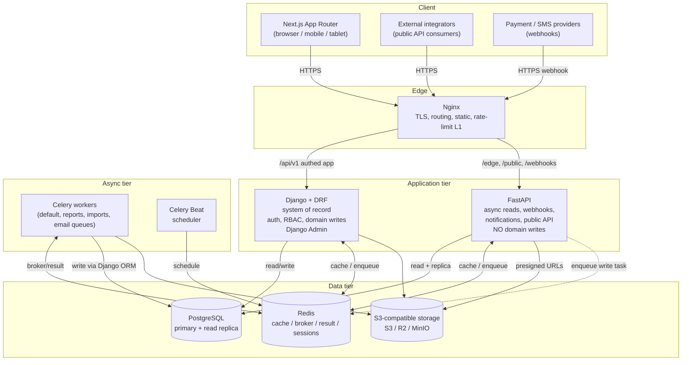
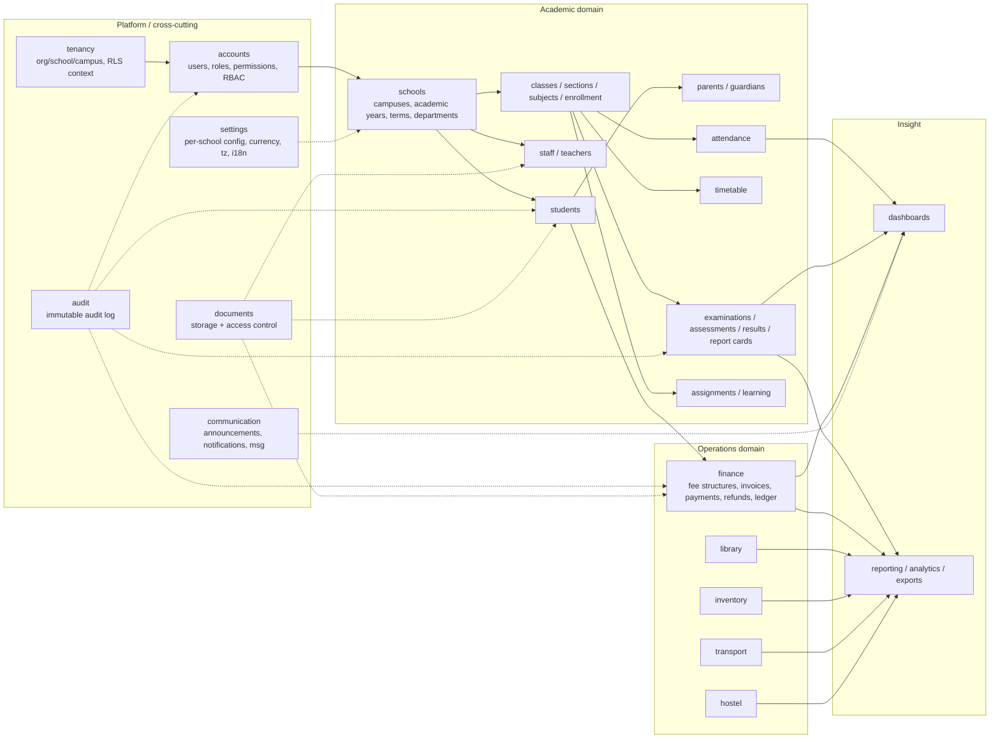
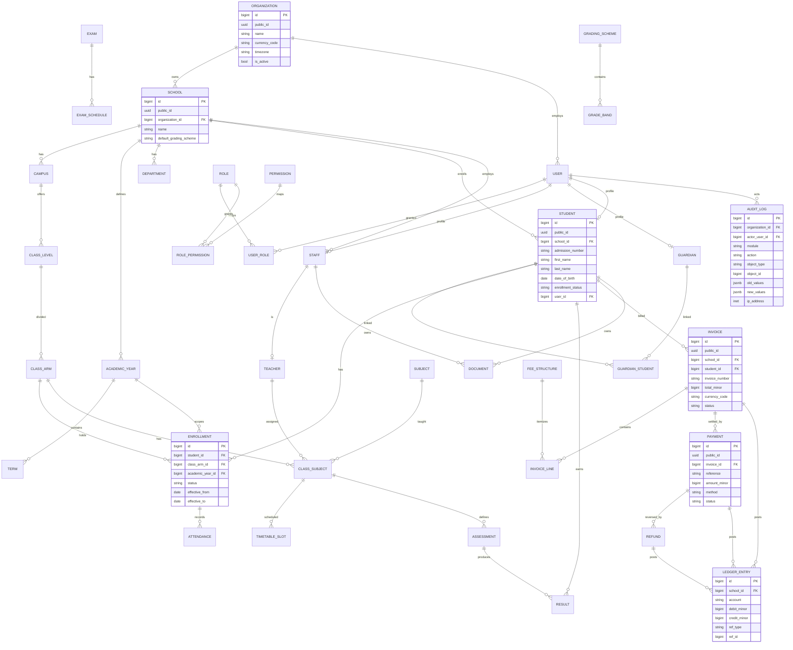
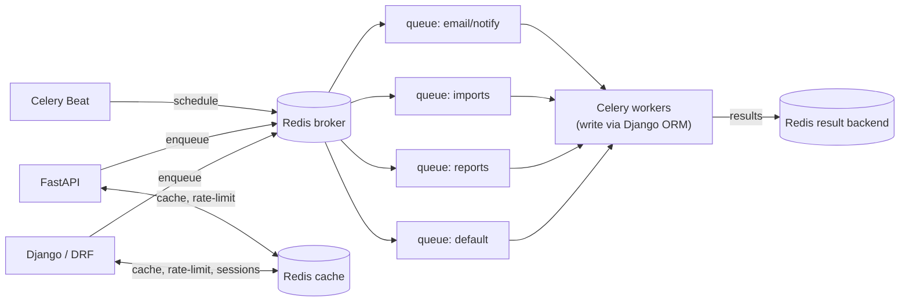
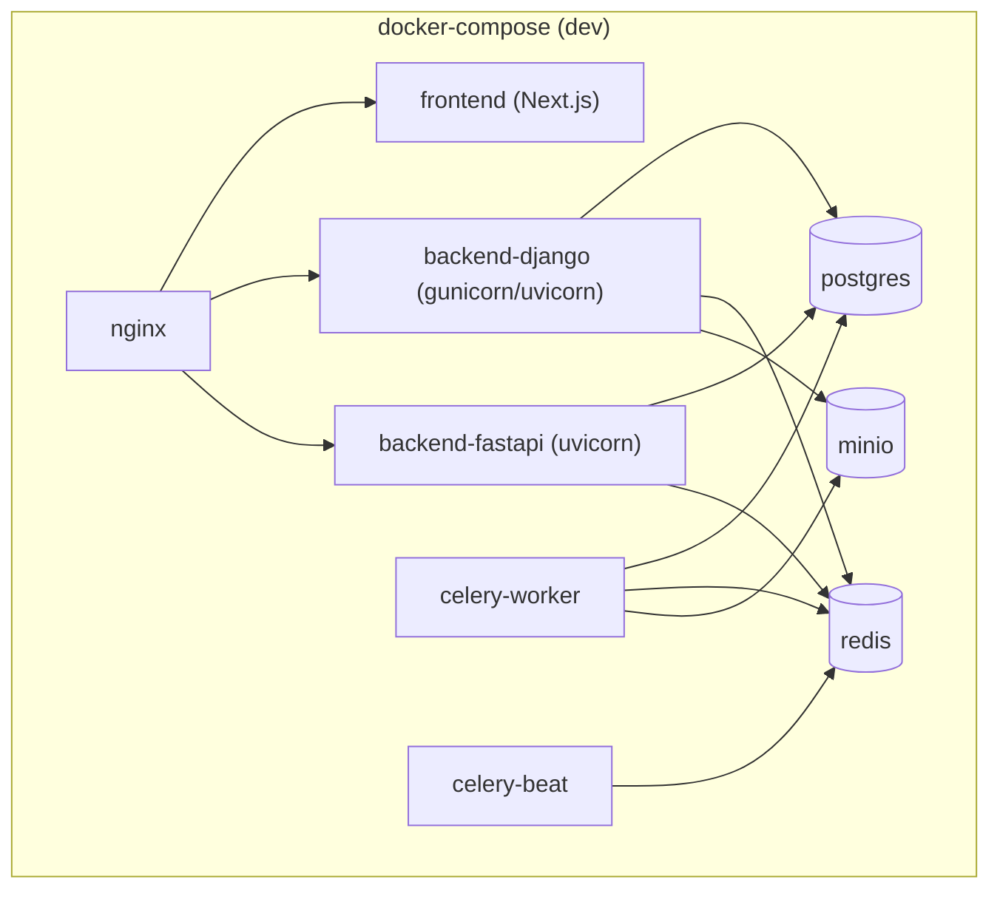

# School Management System — Architecture Specification

**Stack fork:** Standalone Python product (Django + FastAPI + PostgreSQL). Not part of the business-platform monorepo; does not use Supabase.

**Status:** Architecture presentation. No application code is written until the instruction `START MILESTONE 1` is given.

**Stated enterprise assumptions (override or ambiguity resolutions):**

| # | Prompt says | Decision | Why |
|---|---|---|---|
| A1 | Django *and* FastAPI both used "where appropriate", both with an ORM | **Django is the sole system-of-record writer.** FastAPI is a read/webhook/notification/public-API service that never writes domain state; when a write is needed it enqueues a Celery task executing Django ORM code. | Two peer ORMs over one schema causes migration-ownership conflicts and model drift, and makes the prompt's own "single authoritative implementation of business rules" impossible to honour. |
| A2 | "Every query involving tenant-owned resources must enforce tenant context" (app-layer) | **App-layer tenant-scoped managers + PostgreSQL Row-Level Security** keyed on a per-request session variable. | This is Postgres, so RLS is available as defence-in-depth. App code failing to scope a query still cannot leak cross-tenant rows. |
| A3 | "Use Decimal for money" | **Integer minor units stored as `bigint`**, per-currency exponent, wrapped in a `Money` value object. | Consistent money convention across all projects; eliminates float/rounding ambiguity and Decimal-serialization edge cases at API boundaries. |

---

## 1. Executive System Overview

The School Management System (SMS) is a multi-tenant, production-grade platform for primary schools, secondary schools, private/international schools, colleges, and multi-campus organizations. A single deployment serves many independent organizations; each organization owns one or more schools, each school one or more campuses, operating over academic years and terms.

The system is delivered as three cooperating runtimes behind one edge:

- **Django + DRF** — the authoritative core: domain models, migrations, RBAC, authentication infrastructure, all state-changing business workflows, and the internal Django Admin operations console.
- **FastAPI** — a stateless async edge service for high-throughput read paths (reporting, analytics), payment/SMS webhooks, notification dispatch triggers, and the versioned public/integration API. It reads Postgres and enqueues Celery tasks; it does not mutate domain tables directly.
- **Next.js (App Router)** — the responsive, accessible, internationalized (EN + AR/RTL) frontend for all human roles.

Cross-cutting infrastructure: PostgreSQL (primary store), Redis (cache, rate limiting, Celery broker/result, sessions), Celery + Celery Beat (async and scheduled work), and S3-compatible object storage (documents, report cards, media) behind a provider-agnostic abstraction.

The design goals, in priority order: **tenant isolation → data integrity (financial and academic) → security → auditability → performance → developer velocity.** Nothing below trades the first four for the last two.

---

## 2. System Architecture Diagram



The single rule that makes this safe: **every arrow that writes a domain row originates from Django code** — either the Django/DRF process or a Celery worker importing the Django domain layer. FastAPI's only path to a write is enqueuing a task onto Redis.

---

## 3. Technology Architecture

| Layer | Technology | Responsibility |
|---|---|---|
| Language | Python 3.12+ | Backend runtimes and workers |
| Core framework | Django 5.x + Django REST Framework | Models, migrations, auth, RBAC, authoritative API, Admin |
| Async edge | FastAPI + Pydantic v2 + Pydantic Settings | Read APIs, webhooks, notification triggers, public API, OpenAPI |
| DB access | Django ORM (authoritative). SQLAlchemy Core (read-only) permitted inside FastAPI for report queries only | No SQLAlchemy models mirror Django models |
| Database | PostgreSQL 18 | Primary relational store; read replica for reporting |
| Cache / broker | Redis 7 | Cache, rate-limit counters, Celery broker + result, optional sessions |
| Task queue | Celery 5 + Celery Beat | Email, notifications, report generation, bulk import/export, scheduled reminders |
| Object storage | S3 / Cloudflare R2 / MinIO via a `StorageBackend` protocol | Documents, report-card PDFs, media |
| Frontend | Next.js (latest stable) + TypeScript + App Router + Tailwind + shadcn/ui | All user-facing UIs |
| Frontend data | TanStack Query, React Hook Form, Zod | Server-state, forms, client validation |
| Charts | Recharts | Dashboards |
| Auth tokens | JWT access + rotating refresh (reuse detection) | Stateless auth with server-side revocation list in Redis |
| Password hashing | Argon2id | Via Django's password hashers |
| Containerization | Docker + Docker Compose (dev), documented prod topology | Reproducible environments |

---

## 4. Module Architecture



Each box is a Django app under `backend/django_app/apps/`. FastAPI mirrors only the read/edge slice (reporting, public API, webhooks, notification dispatch) and imports the Django domain layer for pure functions and task enqueue.

---

## 5. Database ERD

Core spines shown: **tenancy → identity → academic → finance → governance.** Operational modules (library, inventory, transport, hostel) and their tables are in the full catalogue (§6); a representative subset is diagrammed. Attributes are trimmed to the significant ones for readability.



**Key-shape convention:** every hot table has a `bigint` identity surrogate PK for fast FK joins, plus a `uuid public_id` (unique-indexed) as the only identifier ever exposed externally. Every tenant-owned table carries `school_id` (or `organization_id` at the org tier) and the standard `created_at, updated_at, created_by, updated_by, deleted_at` columns.

---

## 6. Complete Database Entity Catalogue

**Tenancy & identity:** Organization, School, Campus, AcademicYear, Term, User, Role, Permission, UserRole, RolePermission.

**People:** Student, Guardian, GuardianStudent (relationship + relationship_type), Staff, Teacher, Department.

**Academic structure:** ClassLevel (grade), ClassArm (section/stream), Subject, ClassSubject (arm×subject×teacher), Enrollment, AcademicProgram.

**Teaching & attendance:** Attendance (student/teacher/staff, statuses present/absent/late/excused/leave/half_day), AttendanceAudit, TimetableSlot, Room, Period.

**Examinations:** Exam, ExamSchedule, Invigilator, Assessment (test/quiz/assignment/project/practical/exam with weight), Result, ResultWorkflowState, GradingScheme, GradeBand, ReportCard.

**Finance:** FeeStructure, FeeItem, Invoice, InvoiceLine, Discount, Scholarship, Payment, Refund, Receipt, LedgerEntry (double-entry, append-only).

**Learning & comms:** Assignment, AssignmentSubmission, Announcement, Notification, NotificationPreference, Message.

**Operations:** LibraryBook, LibraryCopy, LibraryMember, LibraryLoan, LibraryFine; InventoryItem, Supplier, PurchaseOrder, StockMovement; Vehicle, TransportRoute, RouteStop, TransportAssignment, VehicleMaintenance; Hostel, HostelBuilding, HostelRoom, HostelBed, HostelAllocation, HostelIncident.

**Governance & platform:** Document, AuditLog, SchoolSetting, LoginHistory, FailedLoginAttempt, RefreshTokenRecord.

Total ≈ 60 tables. Append-only tables (`LedgerEntry`, `AuditLog`, `AttendanceAudit`, `LoginHistory`) forbid `UPDATE`/`DELETE` via database triggers.

---

## 7. Multi-Tenancy Strategy

**Model:** shared database, shared schema, row-scoped tenancy. Rejected alternatives: schema-per-tenant (migration explosion across 60 tables × N tenants) and database-per-tenant (operationally heavy, poor cross-org platform analytics for SUPER_ADMIN).

**Hierarchy:** `Organization → School → Campus → AcademicYear → Term`. The isolation boundary is the **Organization**. `school_id`/`campus_id` refine access *within* an org for scoping and reporting but are never the security boundary between tenants.

**Enforcement is layered:**

1. **Request context.** Middleware resolves the tenant strictly from the authenticated user (`request.user.organization_id`) — never from any client-supplied `organization_id`, `school_id`, header, or body field. The resolved org is stashed in a thread-local/`contextvars` request context.
2. **ORM default managers.** Every tenant-owned model uses a `TenantManager` whose base queryset filters on the request context's org. Developers must go out of their way (an explicit `all_tenants()` escape hatch, permitted only in platform-admin code paths) to bypass it.
3. **PostgreSQL RLS (defence-in-depth).** On connection checkout, the app issues `SET app.current_org = <org_id>`. RLS policies on tenant tables (`USING (organization_id = current_setting('app.current_org')::bigint OR current_setting('app.platform_mode', true) = 'true')`) reject cross-tenant rows even if a query forgets the app-layer filter or an SQL-level bug slips through — the live app's DB role (`sms_app` in Railway/Neon) deliberately has no `BYPASSRLS`, so this is real enforcement, not just a documented intent. `app.platform_mode` is the narrow, audited escape hatch: only `apps.tenancy.middleware.AdminPlatformModeMiddleware` ever sets it, and only for staff-authenticated `/admin/` requests — Django Admin is a cross-tenant ops console by design (`apps.core.admin.TenantAdminMixin`), so it needs to see every organization, not just one. Schema migrations run under a separate, table-owning role (`MIGRATE_DATABASE_URL`, Neon's `neondb_owner`) that the live app never uses — the DDL rights migrations need and the RLS restriction live traffic needs are otherwise mutually exclusive for one role under Postgres's `FORCE ROW LEVEL SECURITY` (only `BYPASSRLS`, not ownership, survives `FORCE`).
4. **FastAPI parity.** The async service sets the same session GUC per request from the validated JWT's org claim before any read, so RLS protects the read path identically.

Result: a cross-tenant leak requires *both* an application-layer scoping bug *and* an RLS misconfiguration simultaneously.

---

## 8. Authentication & Authorization Architecture

```mermaid
sequenceDiagram
    participant U as Next.js client
    participant N as Nginx
    participant D as Django/DRF
    participant R as Redis
    U->>N: POST /api/v1/auth/login (email, password, [totp])
    N->>D: forward
    D->>D: verify Argon2id hash, check lockout, check MFA
    D->>R: store refresh-token record (jti, family)
    D-->>U: access JWT (short TTL) + refresh JWT (rotating)
    U->>N: GET /api/v1/students (Bearer access)
    N->>D: forward
    D->>D: authn (JWT) → resolve org → set RLS GUC → RBAC check (module.action)
    D-->>U: tenant-scoped data
    U->>N: POST /api/v1/auth/refresh (refresh)
    N->>D: forward
    D->>R: validate jti; detect reuse → revoke family if reused
    D-->>U: new access + new refresh (old jti retired)
```

**Authentication:** Argon2id hashing; JWT access (short TTL, e.g. 15 min) + rotating refresh (longer TTL) with **token-family reuse detection** (a replayed refresh token revokes the whole family). Refresh records live in Redis for instant revocation. Features: email verification, account activation/deactivation, password reset, account lockout after N failed attempts, `LoginHistory` and `FailedLoginAttempt` records, optional TOTP MFA (required for admin-tier roles by policy). Password hashes are never serialized by any DRF/FastAPI schema.

**Authorization:** centralized, data-driven RBAC. Permissions follow `module.action` (`students.view`, `results.approve`, `fees.refund`, …) stored in `Permission`, grouped by `Role`, granted to users via `UserRole`. No permission string is hard-coded in views scattered across the codebase; a single `require_permission("results.approve")` decorator/DRF permission class resolves against the DB, cached per-user in Redis with explicit invalidation on role change. `CUSTOM_ROLE` lets a school compose its own permission set. Object-level checks (e.g. a parent may only read *their* child) layer on top of tenant scoping.

---

## 9. API Architecture

Two API surfaces, one contract style.

- **Authoritative API (Django/DRF)** under `/api/v1/` — all authenticated app operations and every write. Consistent envelope:

```json
{ "success": true, "data": {}, "message": "Operation completed successfully", "errors": [] }
```

- **Edge API (FastAPI)** under `/edge/v1/` (reporting/analytics reads), `/public/v1/` (versioned integration API, API-key auth), `/webhooks/*` (provider callbacks, signature-verified). Same envelope shape.

Standards across both: versioned paths; correct HTTP status codes; cursor-or-page pagination (`?page=1&page_size=25`, capped) returning `{ "results": [], "pagination": {...} }`; filtering, sorting, search as query params; correlation/request IDs on every response; idempotency keys on payment-related POSTs. Representative resources: `/auth/*`, `/students`, `/attendance`, `/classes`, `/subjects`, `/exams`, `/results`, `/fees`, `/payments`, `/reports`.

---

## 10. Next.js Frontend Architecture

App Router with route groups per role/area. Server Components by default; `"use client"` pushed as low in the tree as possible (forms, charts, interactive tables). TanStack Query owns server state; React Hook Form + Zod own forms with matching server-side validation. shadcn/ui for accessible primitives. Global + module search, notification center, role-aware dashboards.

```
src/
  app/
    (auth)/            dashboard/  students/  teachers/  parents/
    classes/  subjects/  attendance/  timetable/  exams/  results/
    fees/  payments/  library/  inventory/  transport/  hostel/
    reports/  settings/
  components/          # shared primitives (shadcn-derived)
  features/            # per-domain feature modules (ui + hooks + api)
  hooks/  lib/  services/  types/  utils/  providers/
```

Every list is server-paginated (never "load the DB into the browser"). Every form has validation, error/loading/success states, and a disabled submit while pending. i18n via `next-intl` (or equivalent) with EN + AR and full RTL; no user-facing string hard-coded. Loading/empty/error/confirm states are first-class. Dark mode where practical. No secret ever placed in a `NEXT_PUBLIC_` variable.

---

## 11. Django Architecture

Django owns the domain. One app per module (§4). Responsibilities: models + migrations, DRF serializers/viewsets for the authoritative API, RBAC infrastructure, authentication, Django Admin as the **internal ops console only** (never the user-facing app), and every state-changing workflow (enrollment, result publication, payment posting) wrapped in `transaction.atomic()` with `select_for_update()` on contended rows. Business rules live in a `services/` layer inside each app (thin views, fat services), importable by Celery workers and by FastAPI for pure read helpers. `select_related`/`prefetch_related` are mandatory on list endpoints; N+1 is treated as a bug.

---

## 12. FastAPI Architecture

A separate ASGI service for what benefits from async and must not compete with the write path:

- **Reporting/analytics reads** against the Postgres read replica (SQLAlchemy Core, read-only) — heavy aggregations kept off the primary and off Django's request/response path.
- **Webhooks** (payment/SMS providers): verify signature → validate → **enqueue a Celery task** that performs the actual Django-ORM write. FastAPI itself commits nothing to domain tables.
- **Public/integration API** (`/public/v1/`) with API-key auth and stricter rate limits.
- **Notification dispatch triggers** and **health/readiness** for the async tier.

It shares Pydantic settings, the JWT verification logic, and the tenancy GUC-setting logic with the rest of the platform, so RLS protects it identically. `/docs` and `/redoc` are auto-generated here; DRF ships its own OpenAPI schema for `/api/v1/`.

---

## 13. Redis / Celery Architecture



Redis serves cache, rate-limit counters, Celery broker + result backend, and (optionally) sessions. Queues are segregated so a bulk import can't starve transactional email. Celery handles email, notifications, report + report-card generation, bulk import/export, and all scheduled reminders. **Celery Beat** schedules: attendance reminders, unpaid-fee reminders, upcoming-exam reminders, assignment-deadline alerts, overdue-library-book notices, optional birthday notifications, and scheduled reports. Payment webhook processing is idempotent (dedupe on provider event ID).

---

## 14. File-Storage Architecture

A `StorageBackend` protocol abstracts S3 / Cloudflare R2 / MinIO — the provider is configuration, never hard-coded. Binary files never live in Postgres; only metadata rows (`Document`) do. Upload path: validate MIME + magic bytes + size limit → optional virus-scan hook → store under a tenant-scoped key prefix → persist metadata. Downloads are served via short-lived presigned URLs generated only after an authorization + tenant-ownership check; buckets are private. Report-card PDFs and bulk exports are written by Celery workers directly to storage, with a presigned link surfaced to the user on completion.

---

## 15. Security Architecture

OWASP-aligned. Transport TLS terminated at Nginx with HSTS and a strict security-header set (CSP, X-Content-Type-Options, X-Frame-Options/frame-ancestors, Referrer-Policy). Input validated at both edges (Zod client-side, Pydantic/DRF server-side); output serialized through schemas that whitelist fields (no incidental leakage of hashes or internal IDs). Rate limiting at Nginx (L1) and Redis (L2, per-user/per-IP/per-endpoint). Parameterized ORM queries only (no string SQL). CSRF protection on cookie-authenticated flows; JWT flows use `Authorization` headers. Strict CORS allow-list. Secrets only via environment (`.env` never committed; `.env.example` provided). **Authorization is always server-side** — the frontend never gates a protected action, and no client-supplied `school_id`/`role`/`permission` is trusted. Financial and academic mutations are transactional and audited. Immutable audit + append-only ledger by DB trigger.

---

## 16. Docker Architecture



Seven service images: `nginx`, `frontend`, `backend-django`, `backend-fastapi`, `celery-worker`, `celery-beat`, plus `postgres`/`redis`/`minio` for local dev (MinIO stands in for S3/R2). Compose runs the full stack locally; production docs cover managed Postgres + Redis, real object storage, replica configuration, and horizontal scaling of the Django and FastAPI tiers behind the edge. Health checks (`/health`, `/ready`) on every runtime.

---

## 17. Development Roadmap

Architecture (this document) → then the 20-step build order from the prompt, grouped into the 12 milestones below. Each milestone: explain objective → explain design → list dependencies/env/migrations → implement complete files → provide tests + how to run them → verify logically → name the next milestone. No milestone begins until the prior one starts successfully, migrates cleanly, and passes its tests.

---

## 18. Milestones

| Milestone | Scope | Exit criteria |
|---|---|---|
| **M1** | Architecture, repo skeleton, Docker, env config, health/readiness | Stack boots via Compose; `/health` + `/ready` green; migrations run empty |
| **M2** | Auth, users, roles, permissions, multi-tenancy (managers + RLS) | Login/refresh/MFA work; RBAC enforced; cross-tenant read provably blocked |
| **M3** | Schools, campuses, academic years, terms, departments | Tenant hierarchy CRUD under RBAC |
| **M4** | Students, parents/guardians, staff, teachers | Admission → profile; guardian↔student links; HR access controls |
| **M5** | Classes, sections, subjects, enrollment | Enrollment with duplicate-prevention constraints |
| **M6** | Attendance, timetable | Attendance audit trail; timetable conflict detection |
| **M7** | Examinations, assessments, results, report cards | Result workflow (enter→submit→review→verify→publish); PDF report cards via Celery |
| **M8** | Fees, invoices, payments, receipts, finance reports | Transactional payment posting; append-only ledger; refunds as reversals |
| **M9** | Library, inventory, transport, hostel | Inventory/loan/allocation integrity constraints |
| **M10** | Assignments, communication, notifications, documents | Notification center; storage + presigned downloads |
| **M11** | Dashboards, analytics, reports | Role dashboards; export to PDF/Excel/CSV |
| **M12** | Testing, security hardening, performance, prod Docker, CI/CD, docs | E2E on critical flows; CI green; deployment docs complete |

---

## 19. Estimated Implementation Complexity per Module

| Module | Complexity | Primary risks |
|---|---|---|
| Tenancy + RLS | **XL** | Isolation correctness; RLS/manager parity across Django + FastAPI |
| Auth + RBAC | **XL** | Refresh rotation/reuse detection; permission caching invalidation |
| Finance (invoices/payments/ledger) | **XL** | Concurrency, idempotency, append-only ledger, refund-as-reversal |
| Examinations + results | **L** | Multi-stage approval workflow; grading configurability; ranking |
| Timetable | **L** | Conflict detection (teacher/room/class double-booking) |
| Report cards | **L** | Bulk PDF generation off the request path; template correctness |
| Reporting/analytics | **L** | Replica reads; large-dataset performance; export jobs |
| Students / staff / enrollment | **M** | Uniqueness constraints per school; soft-delete/retention |
| Attendance | **M** | Historical-edit protection + audit |
| Transport / hostel | **M** | Capacity and duplicate-allocation constraints |
| Library / inventory | **M** | Stock-movement accuracy |
| Communication / notifications | **M** | Channel preferences; async delivery |
| Documents | **M** | Validation, virus-scan hook, access-controlled URLs |
| Dashboards | **M** | Query efficiency; avoiding overload |
| Schools/campuses/years/terms | **S** | Straightforward tenant CRUD |
| Settings / i18n | **S** | RTL correctness; per-school config surface |

---

## 20. Recommended Repository Structure

```
school-management-system/
  backend/
    django_app/
      apps/
        accounts/  tenancy/  schools/  students/  parents/  staff/
        academics/  attendance/  timetable/  examinations/  finance/
        library/  inventory/  transport/  hostel/  communication/
        documents/  reports/  audit/  settings/
      config/                 # settings, urls, asgi/wsgi, celery app
      manage.py
    fastapi_app/
      api/                    # edge, public, webhooks routers
      services/               # read + dispatch services (no domain writes)
      schemas/  dependencies/  core/   # settings, jwt, tenancy GUC
    shared/                   # money value object, enums, constants
    tests/                    # pytest: unit, api, tenancy-isolation, e2e-backend
    pyproject.toml  .env.example
  frontend/
    src/{app,components,features,hooks,lib,services,types,utils,providers}
    public/  package.json  .env.example
  infrastructure/
    docker/   nginx/   scripts/
  docs/
    README.md  ARCHITECTURE.md  DATABASE.md  API.md  SECURITY.md
    DEPLOYMENT.md  DEVELOPMENT.md  TESTING.md  CONTRIBUTING.md
  docker-compose.yml  .env.example
```

`backend/shared/` holds the single authoritative `Money` value object and shared enums so Django, Celery, and FastAPI agree on money and status semantics without duplicating logic.

---

*Architecture presented. Awaiting `START MILESTONE 1` to begin implementation with complete production-quality files.*
